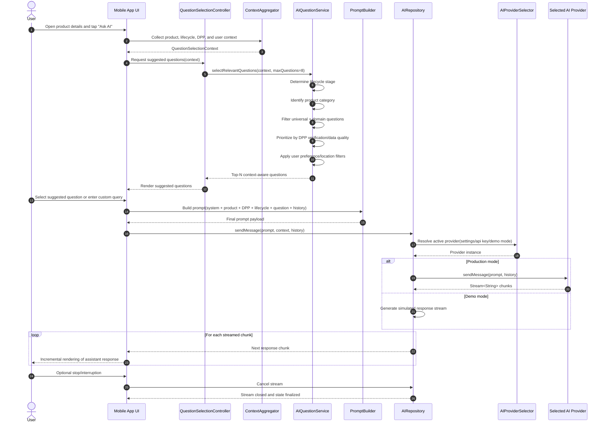

## 6. AI-Powered Contextual Assistance Framework

### 6.1 Framework Architecture

The AI assistance framework implements a **proactive, context-aware communication model** that adapts to user-product relationships. This framework is the core research contribution of this thesis.

#### 6.1.1 Core Principle: Product Lifecycle Stages

The framework is built on the principle that user information needs vary based on their relationship with the product. Three distinct lifecycle stages are defined:

1. **Discovery Stage:** User is exploring the product, considering purchase, comparing alternatives
2. **Ownership Stage:** Product is in user's possession; focus on maintenance, optimization, warranty
3. **End-of-Life Stage:** User seeks to dispose, resell, or repurpose the product

All AI questions and responses are mapped to at least one lifecycle stage to ensure relevance.

#### 6.1.2 Universal Question Categories

Eight universal question categories form the framework's core, applicable across all product types:

1. **Product Basic Information:** Identification, technical specifications, differences from previous versions
2. **Quality and Materials:** Composition, origin, durability, compliance with standards
3. **Price and Value:** Current market price, depreciation, resale value, price alerts
4. **Usage and Maintenance:** Care instructions, common issues, maintenance intervals
5. **Compatibility and Accessories:** Compatibility with other devices, suitable accessories, spare parts
6. **Warranty and Support:** Warranty duration and terms, claim procedures, authorized service centers
7. **Sustainability and Environmental Impact:** Carbon footprint, repairability, recyclability, take-back programs
8. **Resale and Reuse:** Resale platforms, listing assistance, donation options

#### 6.1.3 Domain-Specific Extensions

While universal categories provide broad coverage, domain-specific product categories require specialized questions. The framework supports extensible domain-specific question sets:

- **Electronics:** Battery optimization, software updates, common failures
- **Home Appliances and Tools:** Maintenance schedules, spare parts, error codes
- **Clothing and Footwear:** Material care, size standards, ethical production
- **Furniture and Home Decor:** Material composition, cleaning instructions, assembly/disassembly
- **Vehicles and Bicycles:** Tire pressure, chain maintenance, recalls, resale value
- **Children's Products and Toys:** Age appropriateness, safety certifications, cleaning/storage

This two-tier approach (universal + domain-specific) ensures both broad applicability and deep relevance.

### 6.2 Dynamic Question Selection Logic

The framework implements dynamic question selection based on four contextual parameters:

#### 6.2.1 Product Status

- **Owned:** Product is in user's wallet → Prioritize maintenance, warranty, optimization questions
- **In History:** Product scanned but not owned → Prioritize purchase decision, comparison, sustainability questions
- **New Discovery:** First-time scan → Prioritize basic information, alternatives, value questions

#### 6.2.2 Product Category

Product category determines which domain-specific questions are available:

- Electronics → Battery, software, compatibility questions
- Textiles → Care, material, sustainability questions
- Vehicles → Maintenance, recalls, resale questions

#### 6.2.3 Data Quality

- **DPP Verified:** Product has verified Digital Product Passport data → Questions can reference specific, accurate data
- **User-Entered:** Product data is user-contributed → Questions are more generic, avoid specific claims

#### 6.2.4 User Context

- **Location:** Used for finding nearby service centers, repair shops
- **Previous Interests:** User's past questions and product categories inform relevance
- **Preferences:** User settings (e.g., sustainability focus, price sensitivity)

### 6.3 Question Selection Algorithm

The `AIQuestionService.selectRelevantQuestions()` method implements the selection logic:

```dart
static List<AIQuestion> selectRelevantQuestions(
  QuestionSelectionContext context, {
  int maxQuestions = 8,
}) {
  // 1. Determine product lifecycle stage
  final lifecycleStage = _determineLifecycleStage(context);
  
  // 2. Identify product category
  final productCategory = _identifyProductCategory(context);
  
  // 3. Filter universal questions by lifecycle stage
  final universalQuestions = _getUniversalQuestions()
    .where((q) => q.lifecycleStages.contains(lifecycleStage))
    .toList();
  
  // 4. Get domain-specific questions
  final domainQuestions = _getDomainSpecificQuestions(productCategory)
    .where((q) => q.lifecycleStages.contains(lifecycleStage))
    .toList();
  
  // 5. Prioritize by data quality
  final prioritizedQuestions = _prioritizeByDataQuality(
    [...universalQuestions, ...domainQuestions],
    context.hasVerifiedData,
  );
  
  // 6. Apply user context filters
  final contextualQuestions = _applyUserContext(
    prioritizedQuestions,
    context.userLocation,
    context.userPreferences,
  );
  
  // 7. Return top N questions
  return contextualQuestions.take(maxQuestions).toList();
}
```

### 6.4 AI Provider Abstraction

The framework supports multiple AI providers through an abstraction layer:

#### 6.4.1 Provider Interface

```dart
abstract class AIProvider {
  Future<Stream<String>> sendMessage(
    String message,
    List<Message> history,
  );
  
  Future<bool> validateApiKey(String apiKey);
}
```

#### 6.4.2 Supported Providers

- **OpenAI:** GPT-3.5-turbo, GPT-4 (streaming support)
- **Google Gemini:** gemini-pro (streaming support)
- **Perplexity:** llama-3.1-sonar-small-128k-online (web search capabilities)
- **Deepseek:** deepseek-chat (cost-effective alternative)

#### 6.4.3 Provider Selection

Users can configure their preferred AI provider in settings:

- **API Key Management:** Secure storage of user-provided API keys
- **Provider Switching:** Users can switch providers without losing conversation history
- **Demo Mode:** Test functionality without API keys (uses simulated responses)

### 6.5 Prompt Engineering

The framework constructs prompts that include:

1. **System Context:** Role definition for the AI assistant
2. **Product Information:** Name, brand, EAN, basic specifications
3. **DPP Data:** Relevant Digital Product Passport information (when available)
4. **Lifecycle Context:** Current stage (Discovery/Ownership/End-of-Life)
5. **User Question:** The selected or custom question
6. **Conversation History:** Previous messages in the session

Example prompt structure:

```
You are a helpful product assistant for the THAP app, a digital product 
lifecycle management platform.

Product Information:
- Name: Sony WH-1000XM5 Headphones
- Brand: Sony
- EAN: 4548736123456
- Status: Owned by user

Digital Product Passport Data:
- Expected Lifespan: 3-5 years
- Repairability Index: 7/10
- Battery Type: Lithium-ion, non-replaceable
- Spare Parts: Available through authorized service centers

User Question: How to optimize the life of this battery?

Please provide practical, actionable advice based on the product 
information above.
```

### 6.6 Response Streaming

The framework implements real-time response streaming for improved user experience:

- **Word-by-Word Streaming:** Responses appear incrementally as generated
- **Perceived Performance:** Users see progress immediately, reducing perceived wait time
- **Interrupt Capability:** Users can interrupt long responses if needed

### 6.7 Context-Aware ASK AI Sequence Diagram

The following sequence diagram describes the runtime interaction flow for context-aware question selection, prompt construction, provider routing, and streamed response delivery.



#### 6.7.1 Step-by-Step Use Case Description

1. The user opens a product page and initiates **Ask AI**.
2. The app aggregates runtime context (product metadata, lifecycle stage, DPP availability, and user preferences).
3. The question selection service computes the most relevant suggested questions using lifecycle, category, data quality, and user-context filters.
4. The UI presents the top-ranked suggestions, and the user chooses one or enters a custom question.
5. The prompt builder composes a structured request containing system role, product facts, DPP evidence, lifecycle context, selected question, and chat history.
6. The repository resolves the active AI provider (or demo mode) and sends the prompt through the provider abstraction.
7. The provider returns a streamed response; the UI renders chunks incrementally to improve perceived responsiveness.
8. The user may interrupt generation at any time, after which the stream is canceled and chat state is finalized.